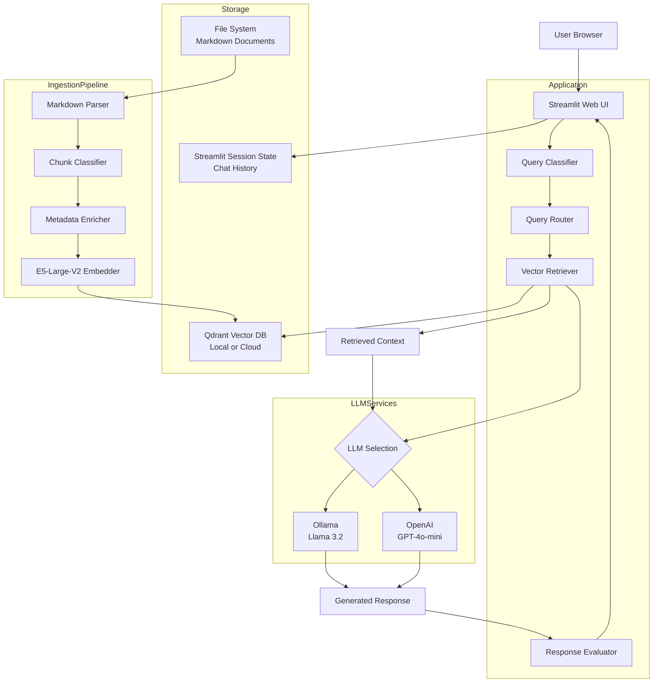
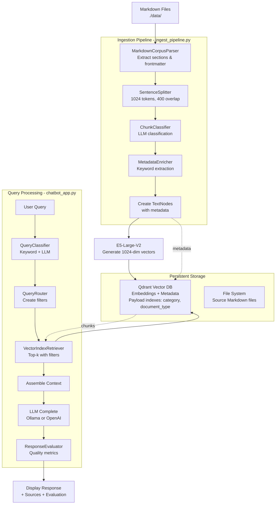
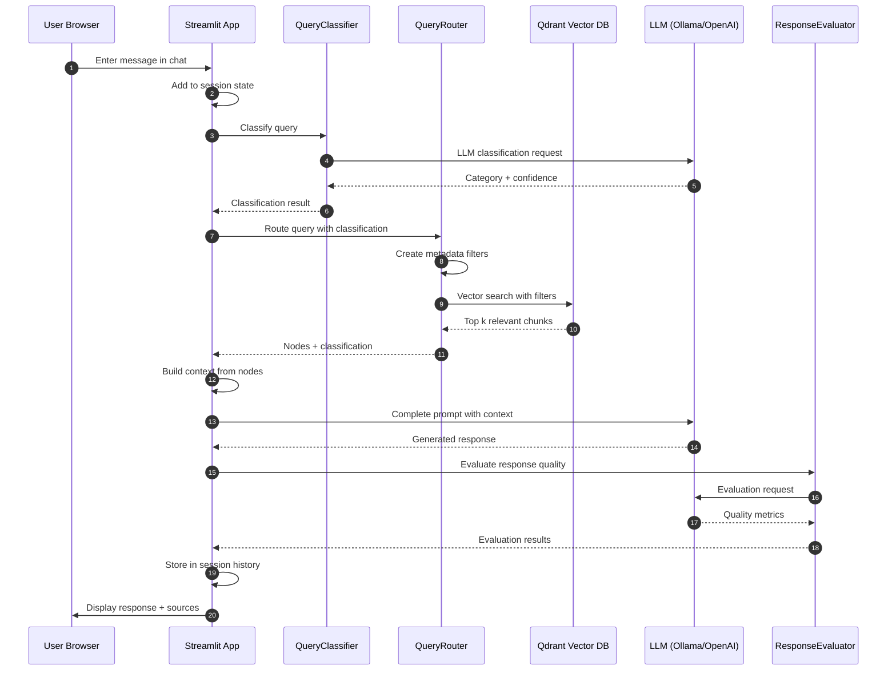

# System Design — AI Chatbot Application

## High-Level Architecture

### Overview
This AI chatbot helps cancer research investigators and data managers understand and navigate data-sharing policies and guidelines (e.g., NIH/NCI rules, datasharing.cancer.gov content). It addresses several key challenges:
- Researchers struggle to determine which policies apply to their specific project (funding source, data type, human vs. animal data, etc.).
- Policy content is distributed across multiple pages, formats, and documents.
- Existing materials are static; users want conversational, context-aware guidance supported by citations and reasoning.

### Implementation Status

**Current Implementation (v1.0):**
- Streamlit-based web application
- Dual LLM support: Ollama (Llama 3.2) and OpenAI (GPT-4o-mini, GPT-4o)
- Local and cloud Qdrant deployment
- Intelligent query classification and routing
- Response quality evaluation
- Source citations with metadata

### Scope

#### Supported Platforms
- **Current**: Streamlit web application (standalone)
- **Future**: Embeddable widget/iframe for datasharing.cancer.gov

#### Core Capabilities
- Natural-language Q&A covering data-sharing policies and guidelines
- Retrieval-Augmented Generation (RAG) over curated Markdown documents
- Intelligent query classification (guidance, policy, process, resources, glossary, faq, news)
- Context-aware query routing with metadata filtering
- Response quality evaluation (relevance, accuracy, completeness, clarity, actionability)
- Chat history with conversation context
- Output that includes:
  - Clear, actionable answers based on retrieved context
  - Source citations with file paths and sections
  - Metadata display (repositories, data types, policy references)
  - Quality metrics for transparency

#### User Features
- Adjustable response creativity (temperature)
- Configurable number of sources
- Toggle query classification display
- Toggle response evaluation display
- Clear chat history
- Example questions for quick start
- Source document snippets

#### Technology Stack
- **UI Framework**: Streamlit
- **Content Source**: Markdown policy documents from datasharing.cancer.gov, NIH, NCI
- **LLM Options**:
  - Ollama with Llama 3.2 (local, free)
  - OpenAI GPT-4o-mini or GPT-4o (cloud, paid)
- **Embedding Model**: intfloat/e5-large-v2 from HuggingFace (1024-dimensional, optimized for semantic search)
- **Vector Database**: Qdrant (local or cloud deployment)
- **RAG Framework**: LlamaIndex

## System Components

### RAG Layer (LlamaIndex)
Responsible for intelligent retrieval and response generation:

**Ingestion Pipeline** (`ingest_pipeline.py`):
- Markdown parsing with section extraction
- LLM-based chunk classification (guidance, policy, process, resources, glossary, faq, news)
- Metadata enrichment (agencies, repositories, data types, requirements)
- Vector index creation with E5-Large-V2 embeddings
- Payload index creation for metadata filtering

**Query Processing** (in chatbot app):
- `QueryClassifier`: Classifies user queries using keywords + LLM
- `QueryRouter`: Routes queries to appropriate document types
- `VectorIndexRetriever`: Retrieves relevant chunks with metadata filtering
- Direct LLM completion (no ChatEngine) for better control
- `ResponseEvaluator`: Evaluates response quality

This layer encapsulates all RAG intelligence.

### LLM & Embedding Models

**LLM Options:**
1. **Ollama + Llama 3.2** (`chatbot_app.py`)
   - Local inference, no API costs
   - 8K context window
   - Used for: query classification, response generation, evaluation
   - Requires: Ollama installation, ~4GB model download

2. **OpenAI GPT** (`chatbot_app_openAI.py`)
   - Cloud inference, API costs apply
   - Models: gpt-4o-mini (default), gpt-4o, gpt-3.5-turbo
   - Better quality for classification and evaluation
   - Requires: OpenAI API key

**Embeddings:**
- **intfloat/e5-large-v2** from HuggingFace
  - 1024-dimensional vectors
  - Optimized for asymmetric semantic search (queries vs documents)
  - Auto-downloaded on first run (~1.3GB)
  - State-of-the-art retrieval performance

### Storage

**Vector Database:**
- **Qdrant** for embeddings + metadata
- Deployment options:
  - Local: `./qdrant_data/` directory
  - Cloud: Qdrant Cloud with HTTPS API
- Collection: `cancer_data_sharing`
- Payload indexes on: `category`, `document_type`

**Session State:**
- **Streamlit Session State** for chat history and memory
- In-memory only (no persistence between sessions)
- `ChatMemoryBuffer` for conversation context (3000 token limit)

**Source Documents:**
- **Local filesystem**: `./data/` directory
- Markdown files organized by type (About, Data, Guidance, News, Process)
- Version controlled with git

### Architecture Diagram



**Key Flow Notes:**
- User interacts directly with Streamlit UI (no separate backend)
- Query is classified → routed → retrieved with metadata filters
- Retrieved context + query sent to LLM (Ollama or OpenAI)
- Response evaluated for quality, then displayed with sources
- Chat history stored in Streamlit session state (in-memory)
- Ingestion pipeline runs separately to populate vector database

## High-Level Data & Indexing Design
(Markdown corpus + LLM chunk classification + metadata-aware RAG)

### Unified Markdown Corpus
All content exists as Markdown files in a single directory:
```
data/
  About/*.md
  Data/*.md
  documents/*.md
  Guidance/*.md
  News/*.md
  Process/*.md
```

These files may contain mixed content:
- Official policy text
- FAQs
- Definitions
- Guidance notes

No manual reorganization is needed. Classification happens during ingestion.

### Ingestion Pipeline (LLM-Assisted)

#### 1. Extract Frontmatter & Body
Metadata is inferred from filename or optional YAML frontmatter.

#### 2. Parse Markdown Structure
Headings, sections, and structure extracted with `MarkdownCorpusParser`.

#### 3. Chunk the Text
Documents split into ~1024 token chunks with 400 token overlap using `SentenceSplitter`.
Section titles preserved for each chunk.

#### 4. Classify Each Chunk with LLM
`ChunkClassifier` uses Llama 3.2 to classify chunks into:
- **guidance** – Guidelines and best practices
- **policy** – Rules and requirements
- **process** – Step-by-step procedures
- **resources** – Training, guides, templates, tools
- **glossary** – Definitions and terminology
- **faq** – Common questions and answers
- **news** – News, announcements, updates

This enables intelligent query routing without restructuring files.

#### 5. Enrich with Metadata
`MetadataEnricher` extracts via keyword matching:
- **agencies**: NIH, NCI, FDA, CDC, NSF, DOD, OSTP, OMB
- **repositories**: dbGaP, SRA, GEO, GDC, PDC, CDS, IDC
- **data_types**: genomic, clinical, imaging, proteomic, transcriptomic, etc.
- **subject_types**: human, animal, cell_line, tissue
- **policy_references**: NIH_DMS_Policy, GDSP, GDS_Policy, DMSP_Requirement
- **requirements**: DMS Plan, Consent, IRB, De-identification, Access Control
- **process_stage**: submission, access, review, registration
- **audience**: investigator, data_manager, institutional_official, irb, data_user
- **compliance_level**: mandatory, recommended, optional
- **keywords**: Top 10 most frequent significant terms

#### 6. Create LlamaIndex Nodes
Each chunk becomes a `TextNode` with:
- Text content
- Complete metadata dictionary
- Unique chunk ID

#### 7. Generate Embeddings & Index
E5-Large-V2 creates 1024-dim vectors, stored in Qdrant with metadata.
Payload indexes created on `category` and `document_type` for fast filtering.

### Unified Vector Index with Metadata Filtering
All nodes are stored in a single vector store.

Retrieval uses metadata filters based on:
- Chunk category
- Question attributes derived from conversation memory

**Examples:**

**Policy queries:**
- `category = "policy"`
- Question attributes:
  - `funder ∈ ["NIH", "NCI"]`
  - `"human"`
  - `"genomic"`

**Definition queries:**
- `category = "glossary"`

**FAQ / guidance queries:**
- `category = "faq"`

This creates logical corpora without physically separating files.

### Query Routing Layer

**Implementation:** Custom `QueryRouter` class with `QueryClassifier`

**Classification Method:**
1. **Keyword matching**: Fast initial classification based on common terms
2. **LLM classification**: Llama 3.2 or GPT validates and refines classification
3. **Returns**: Primary category + secondary categories + confidence score

**Routing Logic:**
- **guidance** queries → Guidance documents
- **policy** queries → Guidance documents (contains policies)
- **process** queries → Process documents
- **resources** queries → Data documents
- **glossary** queries → About documents
- **faq** queries → Guidance documents
- **news** queries → News documents

**Metadata Filtering:**
Creates `MetadataFilters` with OR condition across matched document types.
Uses indexed fields (`document_type`, `category`) for fast filtering.

**Retrieval:**
`VectorIndexRetriever` with:
- Metadata filters from classification
- Configurable top_k (default 5)
- Cosine similarity scoring

### Index Storage
- **Vector Store**: Holds embeddings and metadata
- **Local Document Store**: Maintains chunk metadata and file references
- **Postgres (optional)**: Logs and admin utilities

### Data & Indexing Flow Diagram



## Conversation & Reasoning Flow

### User Input
User enters message in Streamlit chat input:
```
"What are the requirements for sharing human genomic data?"
```

### Query Classification
`QueryClassifier` analyzes the query:
1. Keyword matching: detects "requirements" → policy/guidance
2. LLM classification: confirms primary = "policy", confidence = 0.9
3. Returns: `{"primary_category": "policy", "secondary_categories": ["guidance"], "confidence": 0.9}`

### Query Routing & Retrieval
`QueryRouter` creates metadata filters:
- Maps "policy" → Guidance documents
- Maps "guidance" → Guidance documents
- Creates: `MetadataFilter(key="document_type", value="Guidance", operator=EQ)`

`VectorIndexRetriever` fetches top 5 chunks:
- Filters by document_type = "Guidance"
- Ranks by cosine similarity to query embedding
- Returns nodes with text + metadata

### Context Assembly
Builds context string from retrieved chunks:
```
Chunk 1 text...

Chunk 2 text...

Chunk 3 text...
```

### LLM Prompt Construction
Assembles prompt with:
```
System: You are an expert assistant for cancer data sharing policies...
[Guidelines for response format]

Context information:
[Retrieved chunks]

Question: What are the requirements for sharing human genomic data?

Answer:
```

### LLM Call
- **Ollama**: `llm.complete(prompt)` → Llama 3.2 local inference
- **OpenAI**: `llm.complete(prompt)` → GPT-4o-mini API call

No streaming; full response returned.

### Response Evaluation
`ResponseEvaluator` sends evaluation prompt to LLM:
- Analyzes relevance, accuracy, completeness, clarity, actionability
- Returns JSON with scores 0-10 and feedback
- Displayed in expandable section if enabled

### Output Display
Streamlit displays:
1. **Main response**: Markdown-formatted answer
2. **Query classification** (optional): Category, confidence, secondary categories
3. **Response evaluation** (optional): Metrics and feedback
4. **Sources**: File paths, sections, metadata, text snippets

### Session Persistence
Streamlit session state stores:
- `messages`: List of user/assistant message dicts
- `memory`: ChatMemoryBuffer (not currently used for context)

No database persistence - resets on page refresh.

### Conversation Flow Diagram



## Tech Stack & Deployment

### Core Technologies
- **Frontend/Backend**: Streamlit (integrated)
- **RAG Framework**: LlamaIndex
- **LLM Options**:
  - Ollama + Llama 3.2 (local)
  - OpenAI GPT-4o-mini/GPT-4o (cloud)
- **Embeddings**: HuggingFace E5-Large-V2
- **Vector DB**: Qdrant (local or cloud)
- **Language**: Python 3.10+

### Deployment Options

#### 1. Local Development
```bash
# Install dependencies
pip install -r requirements.txt

# Run ingestion
python ingest_pipeline.py

# Launch chatbot
streamlit run chatbot_app.py  # or chatbot_app_openAI.py
```

#### 2. Streamlit Cloud
- Push to GitHub
- Connect Streamlit Cloud to repository
- Add secrets (OPENAI_API_KEY, QDRANT credentials)
- Deploy automatically

#### 3. Docker
```dockerfile
FROM python:3.10-slim
WORKDIR /app
COPY requirements.txt .
RUN pip install -r requirements.txt
COPY . .
EXPOSE 8501
CMD ["streamlit", "run", "chatbot_app_openAI.py"]
```

#### 4. Kubernetes
- Containerize app
- Deploy to k8s with persistent volume for Qdrant
- Use secrets for API keys
- Scale horizontally if needed

### Current Implementation Status

**✅ Completed:**
- Ingestion pipeline with LLM classification
- Metadata enrichment (7 categories, 40+ metadata fields)
- Vector indexing with Qdrant
- Streamlit UI with chat interface
- Query classification and routing
- Response quality evaluation
- Source citations with metadata
- Dual LLM support (Ollama + OpenAI)
- Local and cloud Qdrant support
- Configurable UI settings

**🚧 Future Enhancements:**
- Conversation memory (ChatMemoryBuffer integrated but not active)
- Project profile tracking across sessions
- Persistent chat history (database)
- Embeddable widget for datasharing.cancer.gov
- Admin dashboard for analytics
- Multi-user support with authentication
- Advanced query routing (hybrid search, re-ranking)
- Feedback collection and model fine-tuning

### Design Decisions

1. **Streamlit Instead of Open WebUI + FastAPI**
   - **Rationale**: Faster development, simpler deployment, lower infrastructure costs
   - **Trade-off**: Less flexibility for complex multi-user scenarios
   - **Future**: Can migrate to API architecture if needed

2. **No Portkey Gateway**
   - **Rationale**: Direct LLM integration is simpler and sufficient for initial use
   - **Trade-off**: Missing fallback, load balancing, and analytics features
   - **Future**: Can add Portkey later if needed

3. **Simplified Categories (7 vs 10)**
   - **Rationale**: Analysis of corpus showed 7 categories cover all content effectively
   - **Categories removed**: scope, technical, privacy_security, costs_funding, data_reuse, compliance, dataset_access
   - **Reason**: These are subsumed by guidance, policy, process, and resources

4. **In-Memory Session State**
   - **Rationale**: Adequate for single-user demo and testing
   - **Trade-off**: Chat history lost on refresh
   - **Future**: Add database persistence for production

5. **Direct LLM Completion vs ChatEngine**
   - **Rationale**: More control over prompt structure, easier debugging
   - **Trade-off**: Less abstraction, manual conversation management
   - **Benefit**: Simpler code, better understanding of RAG flow

### Performance Characteristics

**Query Latency (Ollama + Local Qdrant):**
- Classification: ~2-3 seconds
- Retrieval: <500ms
- Response generation: ~5-10 seconds (depending on response length)
- Evaluation: ~2-3 seconds
- **Total**: ~10-15 seconds per query

**Query Latency (OpenAI + Cloud Qdrant):**
- Classification: ~1-2 seconds
- Retrieval: ~200-500ms (network dependent)
- Response generation: ~2-4 seconds
- Evaluation: ~1-2 seconds
- **Total**: ~5-8 seconds per query

**Costs (OpenAI):**
- GPT-4o-mini: ~$0.01-0.02 per query
- GPT-4o: ~$0.05-0.10 per query
- E5-Large-V2 embeddings: Free (local inference)

### Known Limitations

1. **No conversation context**: Each query is independent
2. **No user authentication**: Single-user mode only
3. **No persistent history**: Lost on page refresh
4. **Limited error handling**: Basic error messages
5. **No streaming**: User waits for complete response
6. **No re-ranking**: Simple cosine similarity retrieval
7. **No query expansion**: Single-turn retrieval only
8. **No multi-document reasoning**: Each chunk processed independently

### Maintenance & Operations

**Regular Tasks:**
- Update Markdown corpus as policies change
- Re-run ingestion pipeline after updates
- Monitor response quality through evaluation metrics
- Update LLM models as newer versions release

**Monitoring:**
- Streamlit logs: User queries and errors
- Evaluation scores: Track quality over time
- Retrieval diagnostics: Verify correct documents returned

**Troubleshooting:**
- Check Ollama/OpenAI connectivity
- Verify Qdrant collection exists and has data
- Review classification results for accuracy
- Inspect retrieved chunks for relevance

## Conclusion

This implementation provides a fully functional RAG-based chatbot for cancer data sharing policies. The Streamlit-based architecture prioritizes simplicity and rapid development while maintaining core functionality for intelligent query answering, metadata-based retrieval, and response quality evaluation.

The system successfully demonstrates:
- LLM-assisted document classification and metadata enrichment
- Intelligent query routing with metadata filtering
- Multi-source response generation with citations
- Quality evaluation for transparency
- Flexible deployment options (local or cloud)

Future enhancements can build on this foundation to add conversation memory, persistent history, authentication, and advanced retrieval techniques as requirements evolve.
