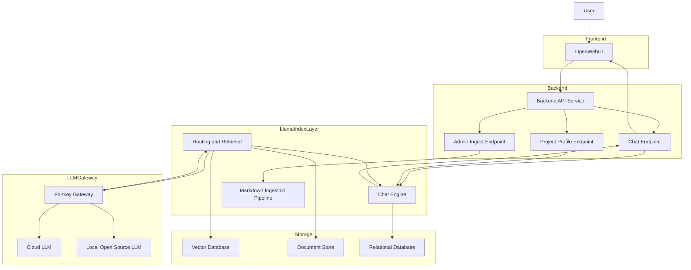
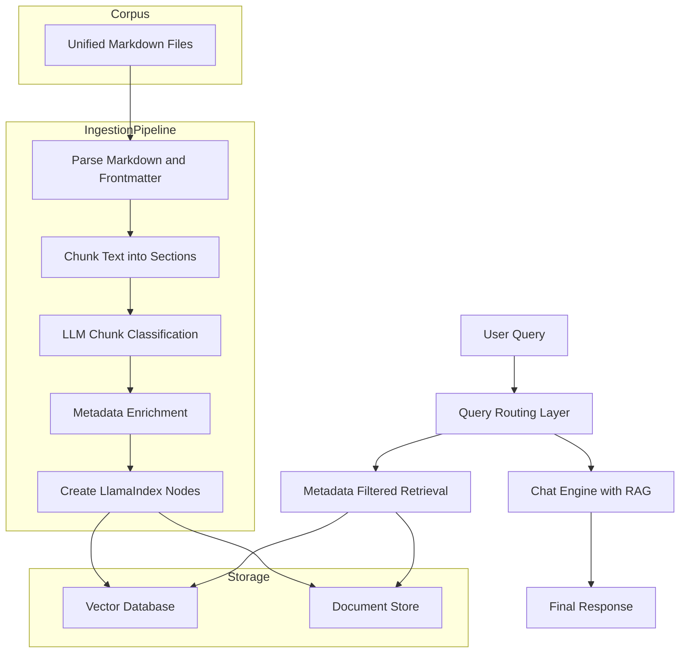
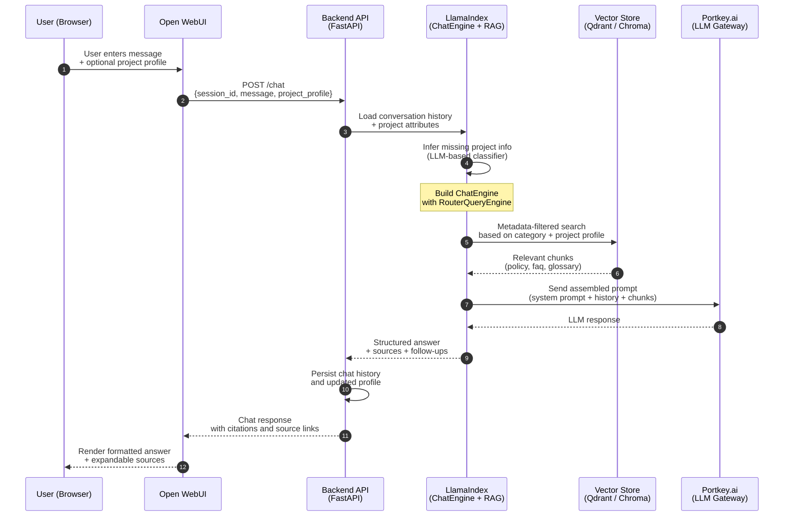

# System Design — AI Chatbot Application

## High-Level Architecture

### Overview
This AI chatbot helps cancer research investigators and data managers understand and navigate data-sharing policies and guidelines (e.g., NIH/NCI rules, datasharing.cancer.gov content). It addresses several key challenges:
- Researchers struggle to determine which policies apply to their specific project (funding source, data type, human vs. animal data, etc.).
- Policy content is distributed across multiple pages, formats, and documents.
- Existing materials are static; users want conversational, context-aware guidance supported by citations and reasoning.

### Scope

#### Supported Platforms (Initial + Near-Term)
- **Primary**: Web-based chat UI (standalone application)
- **Secondary**: Embeddable widget/iframe for integration inside datasharing.cancer.gov

#### Core Capabilities
- Natural-language Q&A covering data-sharing policies and guidelines
- Retrieval-Augmented Generation (RAG) over curated JSON/Markdown documents
- Conversation memory to track project attributes across turns (funder, data type, human/animal, etc.)
- Output that includes:
  - Short summaries of applicable policies
  - Direct links to authoritative sources
  - Explanations of why each policy is relevant

#### Admin Features
- Basic logging of queries and model responses
- Retrieval diagnostics (documents retrieved, vector scores, categories)
- Traffic throttling to avoid abuse or excessive cost

#### Integrations with External Systems
- **Content Source**: Internal repo/storage of Markdown policy documents synced from datasharing.cancer.gov, NIH, NCI, and related sources
- **LLM**: Llama 3.2 via Ollama (local deployment)
- **Embedding Model**: intfloat/e5-large-v2 from HuggingFace (optimized for retrieval tasks)
- **Vector Database**: Qdrant (self-hosted)

## System Components

### Frontend — Open WebUI
Open WebUI serves as:
- The primary user interface for chat interactions
- A workspace for project-specific configurations
- An admin access point for logs and diagnostics
- An embeddable widget provider for datasharing.cancer.gov

A dedicated workspace ("Cancer Data Sharing Assistant") will call a backend `/chat` API with:
- User message
- Session ID
- Optional structured project attributes (funder, human vs. animal, data types)

### Backend API Service (FastAPI or Flask)
The backend orchestrates communication between:
- Open WebUI
- LlamaIndex (RAG + memory)
- Ollama (LLM inference)
- HuggingFace E5-Large-V2 (embeddings)

Key endpoints:
- `POST /chat` – main inference endpoint
- `POST /project_profile` – update or persist user project metadata
- `POST /admin/ingest` – trigger ingestion/indexing (optional, protected)

### LlamaIndex Layer
Responsible for the intelligent retrieval system, including:
- Document ingestion and preprocessing with E5-Large-V2 embeddings
- Building RAG indexes (vector, keyword, summary)
- Conversation-aware ChatEngine
- Routing queries across different content types

This layer encapsulates nearly all "RAG intelligence."

### LLM & Embedding Models
- **LLM**: Llama 3.2 running on Ollama for text generation and chunk classification
- **Embeddings**: intfloat/e5-large-v2 from HuggingFace for semantic search
  - 1024-dimensional embeddings
  - Optimized for asymmetric semantic search (queries vs documents)
  - State-of-the-art performance on retrieval benchmarks

### Storage
- **Vector DB**: Qdrant/Chroma/Weaviate for embeddings + metadata
- **Relational DB (Postgres)**: Users, sessions, project profiles, persisted chat history
- **Object Storage (optional)**: S3/Minio for raw Markdown, PDFs, and HTML snapshots

### Architecture Diagram



Key flow notes:
- User interacts via `OpenWebUI`, which calls `BackendAPI`.
- `BackendAPI` routes to specialized endpoints (`Chat`, `Profile`, `Ingest`).
- Chat & profile requests pass to `ChatEngine` inside the LlamaIndex layer; ingestion triggers `IngestionPipeline`.
- `RouterEngine` performs retrieval (vector + document store) and mediates LLM calls through `PortkeyGateway` (cloud or local models).
- Persistence spans vector DB, document store, and relational DB for conversation/state.

## High-Level Data & Indexing Design
(Markdown corpus + LLM chunk classification + metadata-aware RAG)

### Unified Markdown Corpus
All content exists as Markdown files in a single directory:
```
data/
  About/*.md
  Data/*.md
  documents/*.md
  Guidance/*.md
  News/*.md
  Process/*.md
```

These files may contain mixed content:
- Official policy text
- FAQs
- Definitions
- Guidance notes

No manual reorganization is needed. Classification happens during ingestion.

### Ingestion Pipeline (LLM-Assisted)

#### Extract Frontmatter & Body
Metadata is inferred from filename or section structure.

#### Parse Markdown Structure
Headings, lists, and section titles are extracted for contextual tagging.

#### Chunk the Text
Documents are split into ~1,000–1,500 token chunks. Section titles are recorded for each chunk.

#### Classify Each Chunk with an LLM
Each chunk is classified into one of:
- **Policy** – What rules and mandates apply.
- **Scope** – Who/what the policy covers.
- **Process** – How to submit, share, or access data.
- **Technical** – Formats, metadata, standards.
- **Privacy/Security** – Human data protection, access control.
- **Costs/Funding** – Budgeting and fees.
- **Data Reuse** – How to use/cite shared data.
- **Compliance** – Oversight, enforcement, modifications.
- **Resources** – Training, guides, templates.
- **Dataset Access** – Finding and using datasets/repositories.

This enables precise retrieval behavior without restructuring the physical files.

#### Infer Additional Metadata
Automatic keyword-based inference assigns attributes such as:
- `funding_filters` (NIH, NCI, etc.)
- `subject_filters` (human, animal)
- `repository_tags` (dbGaP, SRA, GEO)
- `policy_requirements` ("DMS Plan", "Consent", "Access Control")

#### Convert Chunks into LlamaIndex Nodes
Each chunk becomes a structured node.

### Unified Vector Index with Metadata Filtering
All nodes are stored in a single vector store.

Retrieval uses metadata filters based on:
- Chunk category
- Question attributes derived from conversation memory

**Examples:**

**Policy queries:**
- `category = "policy"`
- Question attributes:
  - `funder ∈ ["NIH", "NCI"]`
  - `"human"`
  - `"genomic"`

**Definition queries:**
- `category = "glossary"`

**FAQ / guidance queries:**
- `category = "faq"`

This creates logical corpora without physically separating files.

### Query Routing Layer
A lightweight routing mechanism determines how to search:
- Definition queries → glossary chunks
- Policy applicability → policy chunks (possibly with explanation chunks)
- "What should I do?" queries → FAQ + policy
- Example-driven queries → example chunks

Routing can be implemented with LlamaIndex's RouterQueryEngine or custom logic.

### Index Storage
- **Vector Store**: Holds embeddings and metadata
- **Local Document Store**: Maintains chunk metadata and file references
- **Postgres (optional)**: Logs and admin utilities

### Data & Indexing Flow Diagram



## Conversation & Reasoning Flow

### Inputs to `/chat`
Open WebUI sends:
```json
{
  "session_id": "abc123",
  "message": "I have an NCI-funded clinical trial with human genomic data. What rules apply?",
  "project_profile": {
    "funder": "NCI",
    "data_type": ["genomic", "clinical"],
    "subjects": "human"
  }
}
```
The project profile is optional; the model can infer missing attributes over time.

### Context Loading
Backend loads:
- Existing conversation history
- Persisted or inferred project attributes

### Chat Engine Construction
The ChatEngine wraps:
- RouterQueryEngine (policy/faq/glossary Engines)
- Conversation memory
- A system prompt that enforces:
  - Stepwise reasoning internally
  - Clear, concise responses
  - Citations with URLs
  - No hallucinated policies
  - Applicability reasoning based on project attributes

### Retrieval with Filters
For applicability questions, metadata filters narrow RAG retrieval to:
- NIH/NCI content
- Human-subject rules
- Genomic data requirements

Relevant FAQs may also be surfaced.

### LLM Call via Portkey
The final prompt includes:
- System message
- Chat history
- Retrieved chunks
- Project profile summary

Portkey delivers the response through your preferred LLM.

### Output & Persistence
- Backend stores chat history and updated project profile
- Open WebUI displays response with clickable sources

### Conversation Flow Diagram



## Tech Stack & Deployment

### Core Technologies
- **Frontend**: Open WebUI
- **Backend**: FastAPI + LlamaIndex
- **LLM Gateway**: Portkey.ai
- **Vector DB**: Qdrant/Chroma
- **Relational DB**: Postgres
- **Storage**: Local volume or S3

### Deployment Topology (Docker Compose)
- `open-webui`
- `backend-api`
- `vector-db`
- `postgres`

Portkey is accessed via HTTPS (SaaS or self-hosted).

## MVP Scope
- Build ingestion pipeline
- Ingest key NIH/NCI Markdown content
- Implement basic `/chat` endpoint
- Initialize ChatEngine with:
  - Policy index
  - Simple conversation memory
  - System prompt enforcing citations and relevance
- Integrate Open WebUI workspace
- Route all model interactions through Portkey

This provides a complete end-to-end conversational RAG assistant suitable for early demonstration and testing.
